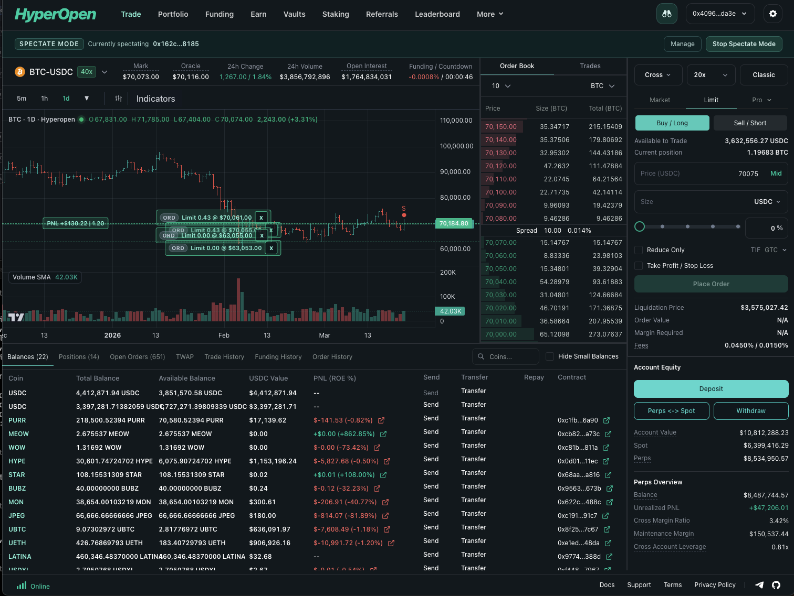
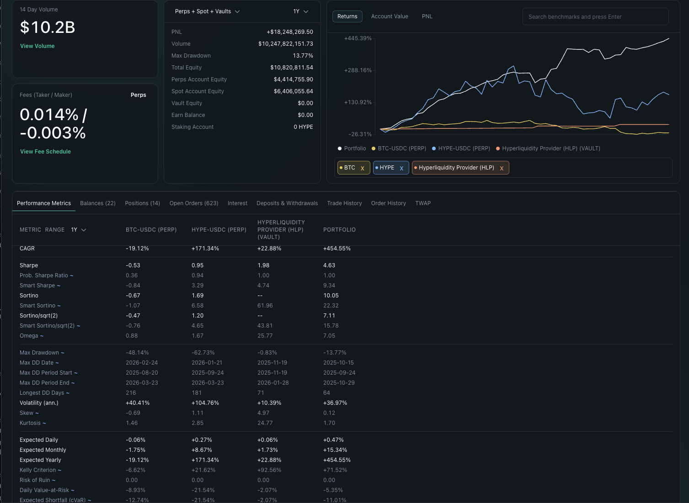

# Hyperopen

> Open-source trading interface for [Hyperliquid](https://hyperliquid.xyz). Inspect it, fork it, make it yours.

[](https://github.com/thegeronimo/hyperopen/actions/workflows/tests.yml)
[](https://github.com/thegeronimo/hyperopen/actions/workflows/tests.yml)
[](https://github.com/thegeronimo/hyperopen/actions/workflows/tests.yml)
[](https://github.com/thegeronimo/hyperopen/actions/workflows/tests.yml)
[](LICENSE)
<p align="center">
  
</p>

<p align="center">
  <em>Trade with full charting, orderbook, and order management in one view.</em>
</p>

<p align="center">
  
</p>

<p align="center">
  <em>Generate performance tearsheets for portfolios and vaults. Benchmark against assets like BTC, HYPE, or HyperLiquidity Provider (HLP) with CAGR, Sharpe, drawdown, and more.</em>
</p>

---

## Table of Contents

- [Quick Start](#quick-start)
- [Why Hyperopen](#why-hyperopen)
- [Current Focus](#current-focus)
- [Project Status](#project-status)
- [Architecture Overview](#architecture-overview)
- [Validation](#validation)
- [Contributing](#contributing)
- [License](#license)

---

## Quick Start

### Prerequisites

- [Node.js and npm](https://nodejs.org/)
- [Java 11+](https://adoptium.net/)
- [Clojure CLI](https://clojure.org/guides/install_clojure)

### Install and run

```bash
npm ci && clojure -P
npm run dev
```

Open [http://localhost:8080](http://localhost:8080) in your browser.

<details>
<summary>More dev commands</summary>

```bash
# Main app plus UI workbench
npm run dev:portfolio

# Same-origin HyperUnit proxy for funding flows
npm run dev:proxy    # opens at http://localhost:8081
```

**Production build:**

```bash
npm run build
```

The release-ready static artifact is generated at `out/release-public`. Smoke-test locally with:

```bash
npx serve -s out/release-public -l 8082
```

</details>

---

## Why Hyperopen

Hyperopen is a community-driven trading interface built around a simple idea: **traders should have control over the software they trade through.**

| | |
|---|---|
| **Inspectable and forkable** | Open-source frontend meant to be studied, modified, and improved by the community |
| **Deterministic by default** | Websocket flows, state transitions, and trading-critical logic live in testable code paths |
| **Explicit execution** | Signing, funding, and order flows are treated as safety-critical surfaces |
| **Practical workflows** | Trade, portfolio, funding, vault, and realtime market views in one codebase |
| **Developed in the open** | Architecture, reliability rules, and product intent are documented in the repository |

---

## Current Focus

- Trade surfaces with charting, order entry, and orderbook workflows
- Portfolio and account views
- Funding and wallet-related flows
- Websocket/runtime reliability and parity testing
- Open architecture with contributor-facing documentation

---

## Project Status

Hyperopen is **under active development**. APIs, UX details, and internal boundaries are still evolving, but the project already enforces strict validation gates for reliability and signing-sensitive changes.

Start here to understand the project:

| Document | What it covers |
|---|---|
| [Architecture Map](ARCHITECTURE.md) | Layering, boundaries, and governance |
| [Security and Signing Safety](docs/SECURITY.md) | Crypto signing rules and credential handling |
| [Reliability Invariants](docs/RELIABILITY.md) | Runtime guarantees and validation gates |
| [Product Specs](docs/product-specs/index.md) | Roadmap and feature specifications |

---

## Architecture Overview

Hyperopen is built with **ClojureScript**, **Replicant** (data-driven rendering), and **Nexus** (action/effect dispatch). The core design principle: most product logic works on plain maps, vectors, and keywords, then hands off side effects to named boundary namespaces.

**Key architectural choices:**

- **Data-oriented state** — Actions return effect descriptors instead of mutating UI objects directly
- **Explicit state flow** — Reducers own transitions, effect interpreters own I/O, tests drive each separately
- **Boundaries at the edge** — Browser APIs, sockets, timers, and storage are pushed to dedicated infrastructure namespaces
- **Projections and view models** — UI consumes derived data, not raw exchange payloads
- **WebSocket runtime** — Realtime handling is a structured runtime with explicit stages, not a single `onmessage` callback

<details>
<summary>Why ClojureScript?</summary>

ClojureScript reinforces the architectural habits this codebase depends on. Product logic is written as functions over plain values — when a function takes a state map, it returns a new value or a vector of effects. Mutation points (`swap!`, browser APIs, sockets) are explicit and confined to boundary namespaces.

This matters for both humans and LLM-assisted development: reasoning stays local, it's easy to tell whether a function transforms data or performs I/O, and targeted edits are safer because mutation points are named and limited. The language also offers long-term stability — most product logic lives in reducers and projections rather than framework-heavy object lifecycles.

</details>

<details>
<summary>Detailed architecture and code walkthrough</summary>

The wiring is visible in:

- [`src/hyperopen/app/bootstrap.cljs`](src/hyperopen/app/bootstrap.cljs) — connects Replicant rendering to Nexus dispatch
- [`src/hyperopen/runtime/wiring.cljs`](src/hyperopen/runtime/wiring.cljs) — registers actions, effects, and runtime watchers
- Feature namespaces like [`src/hyperopen/chart/actions.cljs`](src/hyperopen/chart/actions.cljs) — domain-specific action handlers

**Data-oriented actions** return effect descriptors:

```clj
(defn select-chart-type
  [state chart-type]
  [(chart-dropdown-projection-effect nil [[[:chart-options :selected-chart-type] chart-type]])
   [:effects/local-storage-set "chart-type" (name chart-type)]])
```

**The WebSocket runtime** treats realtime handling as a structured system:

- [`websocket/client.cljs`](src/hyperopen/websocket/client.cljs) — assembles transport, scheduler, clock, router, and config
- [`websocket/application/runtime.cljs`](src/hyperopen/websocket/application/runtime.cljs) — `core.async` channels and topic routing
- [`websocket/application/runtime_reducer.cljs`](src/hyperopen/websocket/application/runtime_reducer.cljs) — state transitions and emitted effects
- [`websocket/infrastructure/runtime_effects.cljs`](src/hyperopen/websocket/infrastructure/runtime_effects.cljs) — transport, timer, and projection side effects

Market topics get sliding buffers while lossless topics (orders, fills) get regular buffers — high-frequency market traffic is smoothed without dropping account data.

**Boundaries** are pushed to the edge: raw provider payloads are normalized once in [`websocket/acl/hyperliquid.cljs`](src/hyperopen/websocket/acl/hyperliquid.cljs), and mutable browser objects stay out of core reducer state.

For the full architecture, see [ARCHITECTURE.md](ARCHITECTURE.md).

</details>

---

## Validation

| Command | What it does |
|---|---|
| `npm run check` | Lint and compile gates for app, worker, docs, and test builds |
| `npm test` | Compile and run the main Node test suite |
| `npm run test:websocket` | Websocket-focused test suite |
| `npm run test:ci` | Full local CI gate (`check` + `test`) |
| `npm run test:watch` | Watch mode for iterating on tests |
| `npm run lint:delimiters -- --changed` | Fast reader-level syntax preflight on changed files |

---

## Contributing

Contributions are welcome. Start with:

- [Architecture Map](ARCHITECTURE.md) — understand the layering and boundaries
- [Frontend Policy](docs/FRONTEND.md) — conventions and code style
- [Quality Scorecard](docs/QUALITY_SCORE.md) — what "good" looks like here
- [Planning and Execution](docs/PLANS.md) — how work is planned
- [Work Tracking](docs/WORK_TRACKING.md) — contributor workflow with `bd` (beads)

The repository uses beads (`bd`) for local issue tracking. Run `bd ready --json` to see unblocked work.

<details>
<summary>Guidelines when changing code</summary>

- Keep pure decision logic in action, reducer, domain, projection, or view-model namespaces. Keep browser APIs, sockets, timers, storage, and fetches in effect or infrastructure namespaces.
- Normalize external payloads once at the boundary or projection helper. Do not let multiple views invent their own parsing rules.
- Prefer explicit effects and derived values over ad hoc mutation of shared state.
- Do not put live websocket, DOM, or timer objects into core app state when a sidecar or interpreter boundary already exists.
- Add or update the focused test nearest the seam you touched before reaching for broader fixes.

</details>

---

## Design Direction

Hyperopen increases user agency in concrete ways:

- **Interface control** — open code, clear architecture, room for community modification
- **Data comprehension** — deterministic computation and explicit runtime truth
- **Execution control** — no hidden trading-critical behavior behind opaque UI flows
- **Community accountability** — roadmap, plans, and quality standards live in the repo

Future work may extend this into user-controlled analytics copilots and automation, but that is not a shipped feature today.

---

## License

[GNU AGPL v3](LICENSE)
