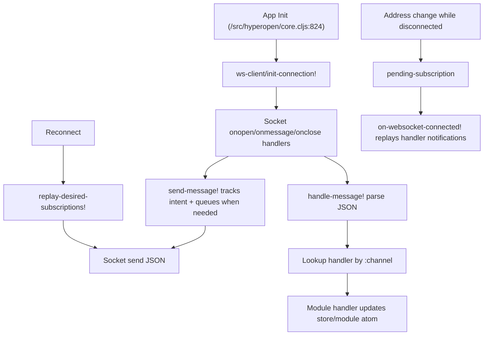
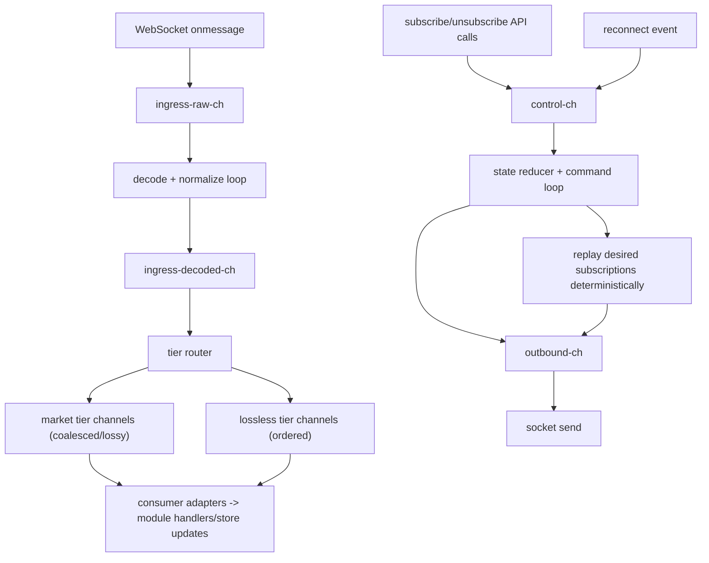

# WebSocket Subscription Architecture Product Review

## Executive Summary

This review compares the current callback-first websocket subscription architecture in Hyperopen with a proposed hybrid architecture that introduces `core.async` channels at control and ingress boundaries while preserving existing feature-module APIs. The current design is functional and has strong reconnect fundamentals, but it mixes connection control, message parsing, dispatch, and backpressure behavior in ways that make high-rate stream behavior harder to reason about and tune consistently.

The decision is to adopt the hybrid channel model. This choice keeps migration risk controlled by preserving public module contracts (`subscribe-*`, `unsubscribe-*`, `init!`) and introducing adapters during rollout, while improving determinism around flow control, queueing, and failure behavior.

Expected impact is a stronger reasoning model for concurrent websocket flows, more predictable burst handling for high-frequency channels, and better observability for runtime behavior. The plan intentionally avoids a full rewrite so implementation can ship incrementally with explicit rollback points.

## Context and Decision Drivers

Locked constraints for this review and recommendation:

- Throughput-first prioritization.
- Hybrid-first architecture direction (`core.async` at key boundaries, not a full rewrite in one step).
- All current websocket channels included in the first migration wave (`l2Book`, `trades`, `activeAssetCtx`, `webData2`, `openOrders`, `userFills`, `userFundings`, `userNonFundingLedgerUpdates`).
- Tiered loss policy: market data streams are lossy/coalesced under pressure; user/account/order streams remain lossless.

Non-goals:

- No websocket server protocol changes.
- No immediate rewrite of store schema or broad state-model refactor in `/hyperopen/src/hyperopen/core.cljs`.

Assumptions and defaults:

- Audience is Engineering + Product.
- Output is a standalone PRD in `/hyperopen/docs/product-specs/`.
- Migration must preserve user-visible behavior during transition.
- Existing reconnect safety behavior must remain intact while internals evolve.

## Current Implementation: How It Works

Current runtime behavior is callback-first with centralized connection management and module-local subscription state.

End-to-end flow:

1. Application startup initializes websocket runtime and stream modules in `/hyperopen/src/hyperopen/core.cljs:824`.
2. Connection bootstrap begins through `init-connection!` in `/hyperopen/src/hyperopen/websocket/client.cljs:399`.
3. Outbound subscribe/unsubscribe and other websocket payloads are sent through `send-message!` in `/hyperopen/src/hyperopen/websocket/client.cljs:432`.
4. Incoming websocket frames are parsed and routed by `handle-message!` in `/hyperopen/src/hyperopen/websocket/client.cljs:386`.
5. On reconnect, desired subscription intent is replayed by `replay-desired-subscriptions!` in `/hyperopen/src/hyperopen/websocket/client.cljs:234`.
6. Address-based subscription changes are deferred if websocket is disconnected and replayed later via address watcher logic at `/hyperopen/src/hyperopen/wallet/address_watcher.cljs:61`.

Current runtime properties:

- Connection health features exist: retry backoff, watchdog for stale sockets, lifecycle hooks, offline handling.
- Outbound intent exists as queue + subscription intent (`outbound-queue`, `desired-subscriptions`).
- Inbound path is single-handler-per-channel callback dispatch (`message-handlers` map).
- Backpressure treatment is uneven by stream. `trades` has local batching; other channels largely update store immediately after parse/dispatch.

## Proposed Implementation: How It Will Work

The proposed model keeps the current websocket manager as the transport boundary but introduces a channel-driven data/control plane inside the client runtime. Existing modules continue calling current public APIs while adapter layers bridge them to the new runtime.

Target architecture:

- Control plane via `core.async` for connection/subscription commands.
- Data plane via `core.async` for inbound frame decode, tier routing, and consumer delivery.
- Compatibility adapters so existing `register-handler!` and module `init!` contracts remain usable during migration.

Channel planes:

- `control-ch`: connect, reconnect, subscribe, unsubscribe, shutdown commands.
- `outbound-ch`: serialized outbound websocket payload stream.
- `ingress-raw-ch`: raw websocket frame payloads.
- `ingress-decoded-ch`: parsed envelopes with normalized metadata.
- `market-tier-ch` (or per-topic market channels): `l2Book`, `trades`, `activeAssetCtx` with lossy/coalesced policies.
- `lossless-tier-ch` (or per-topic lossless channels): user/account/order-critical channels with ordered, non-dropping semantics.

Tiered backpressure policy:

- Market data tier: bounded buffers with coalescing by topic/coin, latest-state-wins under burst.
- User/account/order tier: lossless ordered processing with bounded queues, alarms, and controlled resync path if saturation risk is reached.

### Expected Interface Evolution

Public stability commitments:

- Feature-module APIs remain stable: `subscribe-*`, `unsubscribe-*`, `init!`.
- `register-handler!` remains available during migration through adapter semantics.
- No immediate breaking store-key changes in `/hyperopen/src/hyperopen/core.cljs`.

Internal runtime additions:

- Channel-envelope type:
  `{:topic <string> :tier <keyword> :ts <ms> :payload <map> :socket-id <int>}`
- Command-envelope type:
  `{:op :connect|:reconnect|:subscribe|:unsubscribe|:shutdown :subscription <map>|nil :source <keyword>}`

## Alternatives Considered

Option A: Keep current callback-first architecture.

- Strongest when: team optimizes for minimal short-term change and current throughput is acceptable.
- Fails when: high-rate channel bursts require consistent, explicit, and testable backpressure across all streams.

Option B: Hybrid channel architecture (recommended).

- Strongest when: team needs better concurrent reasoning and burst control while preserving compatibility and lowering rollout risk.
- Fails when: organization expects instant simplification, since transitional adapter complexity exists during migration.

Option C: Full `core.async`-centric rewrite now.

- Strongest when: project can absorb a high-risk refactor and wants a single concurrency model immediately.
- Fails when: migration risk, regressions, and delivery interruption are unacceptable.

Option D: Explicit reducer + JS queues without `core.async`.

- Strongest when: minimizing runtime overhead and dependency surface is primary.
- Fails when: orchestration patterns (fan-out, cancellation, tier composition) become cumbersome and less idiomatic in ClojureScript.

## Comparative Analysis

Scoring scale: `1` low, `5` high.

| Approach                    | Reasoning Clarity            | Throughput                  | Latency Predictability           | Failure Recovery                 | Migration Risk            | Impl Complexity             | Testability                 | Observability                 |
| --------------------------- | ---------------------------- | --------------------------- | -------------------------------- | -------------------------------- | ------------------------- | --------------------------- | --------------------------- | ----------------------------- |
| A. Current callback-first   | 2 - Cross-cutting flow       | 4 - Low overhead path       | 2 - Uneven per stream            | 4 - Existing reconnect solid     | 5 - No migration needed   | 3 - Moderate today          | 3 - Callback tests possible | 2 - Limited runtime signals   |
| B. Hybrid channel model     | 4 - Explicit flow boundaries | 4 - Coalesced market tier   | 4 - Tiered buffering controls    | 5 - Deterministic replay/control | 4 - Incremental rollout   | 4 - Higher than current     | 5 - Loop/reducer invariants | 5 - Queue/tier metrics native |
| C. Full core.async rewrite  | 5 - Single concurrency model | 3 - Overhead and churn risk | 4 - Strong once stabilized       | 5 - Centralized state machine    | 1 - Highest refactor risk | 2 - Very high upfront       | 4 - Strong if finished      | 4 - Strong after completion   |
| D. Reducer + JS queues only | 3 - Explicit but manual      | 5 - Minimal abstractions    | 3 - Depends on custom discipline | 3 - Recovery logic manual        | 3 - Medium if scoped      | 3 - Medium-high custom code | 3 - Testable but bespoke    | 3 - Must be hand-built        |

## Advantages and Disadvantages by Approach

### Current callback-first approach

Product-facing advantages:

- Existing reconnect behavior is already resilient for common disconnects.
- Low immediate engineering disruption means no near-term feature slowdown from infrastructure churn.

Product-facing disadvantages:

- Burst behavior is less predictable across channels, which can increase UI jitter under heavy market traffic.
- Inconsistent backpressure policy can make perceived responsiveness vary by feature.

Engineering-facing advantages:

- Simple direct dispatch path is easy to follow for small channel counts.
- Existing test coverage already validates key reconnect and queue mechanics.

Engineering-facing disadvantages:

- Reasoning about queueing, retry, parse, and handler side effects requires tracking multiple mutable atoms and callback paths.
- Backpressure behavior is not uniformly modeled, increasing risk of subtle regressions at scale.

### Proposed hybrid channel approach

Product-facing advantages:

- Smoother high-frequency UX through coalescing and bounded market-tier policies.
- Stronger correctness guarantees for user/account/order-critical streams through lossless tier semantics.

Product-facing disadvantages:

- Transition period can temporarily add operational complexity if instrumentation is incomplete.
- Mis-tuned buffering policies could affect timeliness if thresholds are set poorly.

Engineering-facing advantages:

- Clearer boundaries between control and data planes improve debuggability and incident response.
- Deterministic command/replay model simplifies reconnection reasoning and failure analysis.
- Better observability with queue-depth, drop/coalesce, and processing-latency metrics.

Engineering-facing disadvantages:

- More moving parts (channels, loops, adapters) increase baseline cognitive load.
- Requires disciplined rollout and invariant-based testing to avoid migration regressions.

## Recommendation

Adopt Option B, the hybrid `core.async` channel model, as the implementation direction.

Why this is the best fit:

- It satisfies throughput-first goals with explicit burst handling for market streams.
- It improves robustness and reasoning with deterministic control/data flow boundaries.
- It preserves incremental delivery by keeping current public module APIs stable during migration.
- It avoids the high product and delivery risk of a full rewrite while materially improving operability.

## Migration Plan

### Phase 1: Instrumentation and observability baseline

Work:

- Add runtime counters for queue depth, decode latency, coalesced/drop counts, reconnect causes.
- Add logging hooks scoped by channel tier.
  Rollback point:
- Instrumentation is additive. If unstable, disable via feature flag and keep current behavior.

### Phase 2: Runtime skeleton with channel planes

Work:

- Introduce `control-ch`, `outbound-ch`, `ingress-raw-ch`, `ingress-decoded-ch`.
- Keep callback dispatch active via adapters.
  Rollback point:
- Route `onmessage` directly back to legacy `handle-message!` and bypass channel demux.

### Phase 3: Channel consumer migration by tier

Work:

- Migrate all stream consumers to tiered channels.
- Enable market coalescing and lossless user/account processing.
  Rollback point:
- Re-enable legacy per-channel handlers for affected channels individually.

### Phase 4: Outbound command channel and deterministic replay

Work:

- Move subscribe/unsubscribe/connect intents through command envelopes on `control-ch`.
- Centralize desired-subscription replay ordering in reducer loop.
  Rollback point:
- Fall back to legacy `send-message!` intent tracking and replay behavior.

### Phase 5: Legacy path removal and hardening

Work:

- Remove callback-first ingress bypass.
- Keep adapter compatibility only where necessary for module APIs.
- Finalize SLO dashboards and runbooks.
  Rollback point:
- Tagged release fallback to Phase 4 implementation with dual-path support retained.

## Test and Validation Scenarios

Connection lifecycle and reconnect invariants:

- Verify connect, disconnect, intentional disconnect, and reconnect transitions remain correct.
- Confirm intentional disconnect does not auto-retry unexpectedly.

Subscription replay determinism:

- Validate FIFO for outbound queue plus deterministic desired-subscription replay after reconnect.

Burst load behavior by tier:

- Synthetic burst tests for market streams validate coalescing and bounded queue depth.
- Lossless tier tests validate ordered delivery without silent drops.

Address-watcher deferred subscription behavior:

- Validate address change while disconnected stores pending intent and processes it on reconnect.

Required scenario coverage:

- FIFO and replay correctness under reconnect.
- Market coalescing correctness under synthetic burst traffic.
- Lossless ordering for user/account channels.
- Intentional disconnect never auto-retries unexpectedly.
- Watchdog stale-close and clean recovery path.
- Address change while disconnected processes pending subscriptions on reconnect.

Current test environment note:

- Full `npm test` is currently blocked by a Node import issue for `lightweight-charts` (`No "exports" main defined`).
- Websocket-focused tests should be runnable independently while that unrelated baseline issue is resolved.

## Risks and Mitigations

| Risk                              | Impact                                                     | Mitigation                                                                                     |
| --------------------------------- | ---------------------------------------------------------- | ---------------------------------------------------------------------------------------------- |
| Complexity and cognitive overhead | Slower onboarding and debugging if undocumented            | Keep architecture diagrams, envelope specs, and runbooks in repo; add invariant-focused tests. |
| Loss-policy misconfiguration      | Over-coalescing can reduce data freshness for market views | Use per-topic policy config with safe defaults and staged rollout by channel.                  |
| Queue saturation in lossless tier | Potential memory pressure or delayed critical updates      | Bound queues, emit alerts, and trigger controlled resync/reconnect rather than silent drops.   |

## Success Metrics

Queue depth ceilings per tier:

- Market tier: p95 queue depth <= 200 envelopes per topic during sustained burst tests.
- Lossless tier: queue depth <= 500 envelopes, with `0` silent drops and alerting at 80% capacity.

Reconnect recovery SLO:

- Recover to healthy subscribed state within <= 3 seconds (p95) after recoverable disconnects.

Message processing latency percentiles:

- Ingest-to-consumer latency targets: p50 <= 20 ms, p95 <= 75 ms, p99 <= 150 ms by tier/channel.

Drop/coalesce counters for market tiers:

- Continuous counters exposed per channel and coin; alert if coalescing ratio exceeds configured thresholds for 5 minutes.

No-loss assertions for user/account tiers:

- Ordered sequence assertions plus no-silent-drop guarantees verified in tests and telemetry (`drops = 0` across release qualification runs).

Glossary:

- `desired-subscriptions`: Map of subscription intents used for deterministic replay after reconnect.
- `outbound-queue`: Buffered outbound websocket payloads sent when connection is unavailable.
- `message-handlers`: Current callback registry from channel string to handler function.
- `pending-subscription`: Address-watcher deferred old/new address subscription transition applied once websocket reconnects.
